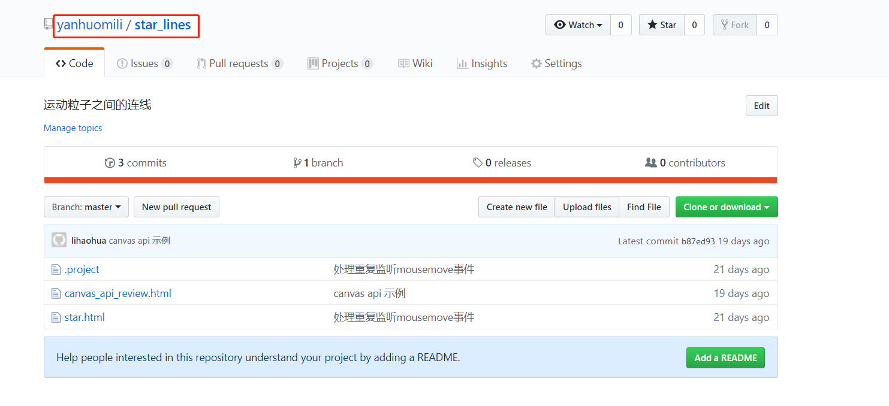

###Welcome to use MarkDown

# 模仿vue-cli搭建自己的脚手架

1. 创建文件夹testcli，使用命令行工具进入到testcli文件夹下面

2. 初始化项目 ,命令行输入npm init，一路回车，遇到repository提示的时候填写自己的github账号，这时候package.json文件初始化完成

3. 在根目录下创建bin文件夹，bin文件夹里面创建分别创建没有后缀名的文件：lhh、lhh-add、lhh-delete、lhh-list、lhh-init。向文件里面添加如下代码：
```
	#!/usr/bin/env node
	console.log('test-cli')
```
这时候在命令号输入：node ./bin/lhh,就会打印出来test-cli。但是这样很麻烦，为了方便简洁，我们直接在package.json文件里面配置简洁命令。

4. package.josn文件添加如下
```json
	"bin": {
	    "lhh": "bin/lhh",
	    "lhh-add": "bin/lhh-add",
	    "lhh-delete": "bin/lhh-delete",
	    "lhh-list": "bin/lhh-list",
	    "lhh-init": "bin/lhh-init"
	},
 ```
然后在命令行输入：npm link。将bin里面的命令绑定到终端里面，这时候在命令行输入lhh就可以打印出test-cli。

5. 创建template.json文件，用来存放模板的名称和信息，这里我默认存放自己github上面的一个项目，当使用脚手架的时候就可以下载，类似vue-cli构建项目一样。

6. 构建cli需要用到一下模块：inquirer、chalk、ora、download-git-repo，我们只要在package.json文件里面添加一下代码，然后在命令行执行npm insatll,就可以将依赖安装好
```
	"dependencies": {
	    "chalk": "^2.4.2",
	    "commander": "^2.19.0",
	    "download-git-repo": "^1.1.0",
	    "inquirer": "^6.2.2",
	    "ora": "^3.2.0"
	},
```
> 下面开始写指令了

7. lhh-add指令，使用该指令是将模板添加到下载列表，当我们使用coa-init时就可以选择下载那个模板。(vue-cli脚手架是没有添加功能的，这里是为了模拟测试。)使用lhh-add指令的时候，模板名称可以自己定义，模板地址就是用github上面的项目地址,只要写红框框住的即可

将一下代码添加到lhh-add文件里面
```
	#!/usr/bin/env node
	 
	// 交互式命令行
	const inquirer = require('inquirer')
	// 修改控制台字符串的样式
	const chalk = require('chalk')
	// node 内置文件模块
	const fs = require('fs')
	// 读取根目录下的 template.json
	const tplObj = require(`${__dirname}/../template`)
	 
	// 自定义交互式命令行的问题及简单的校验
	let question = [
	 {
	 name: "name",
	 type: 'input',
	 message: "请输入模板名称",
	 validate (val) {
	  if (val === '') {
	  return 'Name is required!'
	  } else if (tplObj[val]) {
	  return 'Template has already existed!'
	  } else {
	  return true
	  }
	 }
	 },
	 {
	 name: "url",
	 type: 'input',
	 message: "请输入模板地址",
	 validate (val) {
	  if (val === '') return 'The url is required!'
	  return true
	 }
	 }
	]
	 
	inquirer
	 .prompt(question).then(answers => {
	 // answers 就是用户输入的内容，是个对象
	 let { name, url } = answers;
	 // 过滤 unicode 字符
	 tplObj[name] = url.replace(/[\u0000-\u0019]/g, '')
	 // 把模板信息写入 template.json 文件中
	 fs.writeFile(`${__dirname}/../template.json`, JSON.stringify(tplObj), 'utf-8', err => {
	  if (err) console.log(err)
	  console.log('\n')
	  console.log(chalk.green('Added successfully!\n'))
	  console.log(chalk.grey('The latest template list is: \n'))
	  console.log(tplObj)
	  console.log('\n')
	 })
	})
```
8. lhh-delete指令，将已经添加的模板删除。(vue-cli脚手架是没有删除功能的，这里只是为了模拟测试。)将一下代码添加到lhh-delete文件里面

```
	#!/usr/bin/env node
	 
	const inquirer = require('inquirer')
	const chalk = require('chalk')
	const fs = require('fs')
	const tplObj = require(`${__dirname}/../template`)
	 
	let question = [
	 {
	 name: "name",
	 message: "请输入要删除的模板名称",
	 validate (val) {
	  if (val === '') {
	  return 'Name is required!'
	  } else if (!tplObj[val]) {
	  return 'Template does not exist!'
	  } else {
	  return true
	  }
	 }
	 }
	]
	 
	inquirer
	 .prompt(question).then(answers => {
	 let { name } = answers;
	 delete tplObj[name]
	 // 更新 template.json 文件
	 fs.writeFile(`${__dirname}/../template.json`, JSON.stringify(tplObj), 'utf-8', err => {
	  if (err) console.log(err)
	  console.log('\n')
	  console.log(chalk.green('Deleted successfully!\n'))
	  console.log(chalk.grey('The latest template list is: \n'))
	  console.log(tplObj)
	  console.log('\n')
	 })
	})
```
9. lhh-list指令，该指令可以查看脚手架可下载的模板。将一下代码添加到lhh-list文件

```
	#!/usr/bin/env node
	 
	const tplObj = require(`${__dirname}/../template`)
	console.log(tplObj)
```
10. lhh-init指令，下载模板核心指令，lhh lhh-init <templateName> <projectName>,(就像vue init webpack myproject) 将一下代码添加到lhh-init文件

```
	#!/usr/bin/env node
	 
	const program = require('commander')
	const chalk = require('chalk')
	const ora = require('ora')
	const download = require('download-git-repo')
	const tplObj = require(`${__dirname}/../template`)
	 
	program
	 .usage('<template-name> [project-name]')
	program.parse(process.argv)
	// 当没有输入参数的时候给个提示
	if (program.args.length < 1) return program.help()
	 
	// 好比 vue init webpack project-name 的命令一样，第一个参数是 webpack，第二个参数是 project-name
	let templateName = program.args[0]
	let projectName = program.args[1]
	// 小小校验一下参数
	if (!tplObj[templateName]) {
	 console.log(chalk.red('\n Template does not exit! \n '))
	 return
	}
	if (!projectName) {
	 console.log(chalk.red('\n Project should not be empty! \n '))
	 return
	}
	 
	url = tplObj[templateName]
	 
	console.log(chalk.white('\n Start generating... \n'))
	// 出现加载图标
	const spinner = ora("Downloading...");
	spinner.start();
	// 执行下载方法并传入参数
	download (
	 url,
	 projectName,
	 err => {
	 if (err) {
	  spinner.fail();
	  console.log(chalk.red(`Generation failed. ${err}`))
	  return
	 }
	 // 结束加载图标
	 spinner.succeed();
	 console.log(chalk.green('\n Generation completed!'))
	 console.log('\n To get started')
	 console.log(`\n cd ${projectName} \n`)
	 }
	)
```
> 发布到npm

1. 根目录下创建.npmignore文件，并写入/node_modules,发布的时候忽略node_modules文件

2. npm官网注册一个账号，同时搜索一下lhh-cli有没有人用过

3. 
